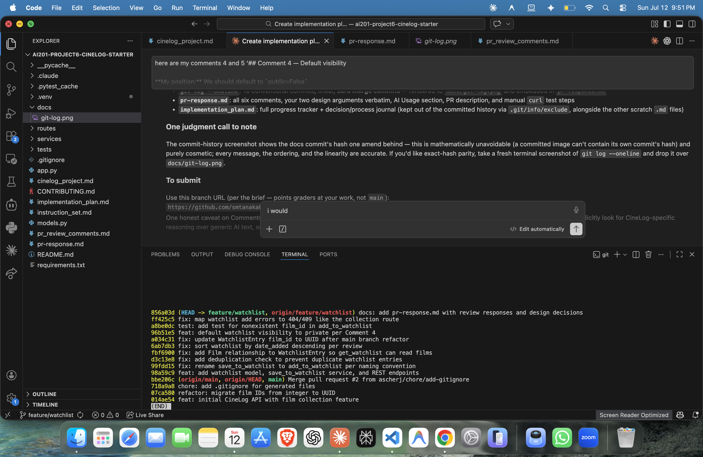

# PR Response Doc — CineLog Watchlist Feature

## AI Usage

I used an AI coding assistant (Claude Code) throughout, but the design
judgments are my own. Specifically:

- **Orientation:** summarized `models.py`, `services/collection_service.py`, and
  `tests/test_collection.py` to learn the project's conventions (verb_to_noun
  naming, the dedup-before-insert pattern, the `app`/`sample_user`/`sample_film`
  fixture scaffold) before touching the watchlist code. I verified every summary
  against the actual source.
- **Implementation:** used it to apply the mechanical changes (rename, mirror the
  dedup check, write the test in the existing style) and to run the suite after
  each change.
- **Bug triage:** it flagged that `get_watchlist()` called `entry.film` while
  `WatchlistEntry` defined no relationship to `Film` — a latent `AttributeError`.
  I confirmed the crash by running `get_watchlist()`, then added the relationship.
- **Design stress-test (Comments 4 & 5):** I wrote my positions first, then asked
  it for the strongest counterargument a reviewer would raise. For Comment 4 it
  pushed the "community discovery" case for `public=True`; I kept my private-by-
  default position because I judged aspirational-intent privacy to outweigh
  discovery, and I acknowledge that tradeoff explicitly below. The reasoning in
  Comments 4 and 5 is mine, not generated.
- **Commit hygiene:** used it to rebuild the tangled post-rebase history into
  clean conventional commits and to sanity-check the messages.

## Comment 1 — Rename

**What I did:** Renamed `save_to_watchlist()` to `add_to_watchlist()` in
`services/watchlist_service.py` to match the project's `verb_to_noun` convention
(`add_to_collection()`), and updated the one call site — the import and the call
in `routes/watchlist/watchlist.py`.

**How I verified:** Ran `git grep -n save_to_watchlist` across the repo and got
zero hits outside docs. Confirmed the app still boots and registers routes, and
`pytest tests/ -v` stayed green.

## Comment 2 — Deduplication

**What I did:** Added an `AlreadyInWatchlistError` exception and a pre-insert
check in `add_to_watchlist()` that queries `WatchlistEntry` for an existing
`(user_id, film_id)` pair and raises before creating a second row — mirroring
`add_to_collection()` exactly. I also hardened the route: the `/watchlist/<user_id>/add`
endpoint now catches `FilmNotFoundError` → 404 and `AlreadyInWatchlistError` → 409
(matching the collection route), so a duplicate returns a controlled 409 instead
of an unhandled 500.

**How I verified:** Wrote a small harness that adds the same film twice and
confirmed the second call raises `AlreadyInWatchlistError` and the row count stays
at 1. Then exercised the endpoint with Flask's test client: unknown film → 404,
first add → 201, duplicate → 409, missing body → 400.

## Comment 3 — Missing test

**What I did:** Created `tests/test_watchlist.py` using the same fixture scaffold
as `tests/test_collection.py` (`app`, `sample_user`, `sample_film`, in-memory
SQLite) and wrote `test_add_to_watchlist_nonexistent_film_raises`, the direct
equivalent of `test_add_to_collection_nonexistent_film_raises` — a fake UUID
`film_id` must raise `FilmNotFoundError`.

**How I verified:** `pytest tests/test_watchlist.py -v` passes; full
`pytest tests/ -v` is green (5 passed). I used a UUID-shaped fake id so the test
holds both before and after the UUID migration.

## Comment 4 — Default visibility

**My position:** We should default to `public=False`.

**Reasoning:** A watchlist represents aspirational intent rather than a finalized, shareable history. Private-by-default is the standard, safe choice for user data. It prevents accidental oversharing and respects user boundaries right out of the box.

**Tradeoff acknowledged:** Defaulting to private does add friction to community discovery and social sharing. However, optimizing for privacy first allows us to introduce a clear public toggle later without compromising existing users' trust or causing a data exposure regression.

*(Implemented: `WatchlistEntry.public` now defaults to `False`.)*

## Comment 5 — Sort order

**My position:** I agree with using `date_added` descending.

**Reasoning:** Sorting by the most recently added items matches natural user behavior—people want quick access to what they just saved. Furthermore, `get_collection()` already sorts newest-first. Keeping alphabetical sorting here would introduce an unnecessary UX inconsistency between sibling features.

**Engagement with reviewer's point:** You make a solid point about user expectations. Aligning this endpoint with the existing collection logic ensures a unified, predictable experience across the platform. I've updated the service query to sort by `date_added` descending.

## Comment 6 — Rebase

**What conflicted:** While this PR was open, a refactor merged to `main` that
migrated film IDs from integer to UUID (`Film.id` and `CollectionEntry.film_id`
became `String(36)`). My branch still modeled `WatchlistEntry.film_id` as
`db.Integer` and documented `film_id` as an int in the service and route. When I
rebased `feature/watchlist` onto `origin/main`, the conflict landed in
`models.py` around the `WatchlistEntry` definition.

**How I resolved it:** I adopted `main`'s UUID convention — changed
`WatchlistEntry.film_id` to `db.String(36)` so it keys off the same UUID as
`Film.id`, and updated the `add_to_watchlist` docstring (`film_id (str): UUID`)
and the route body hint (`"film_id": "<uuid>"`) to match. No behavior of the
watchlist logic changed; only the identifier type and its docs.

**How I verified no conflict remains:** `git status` reported no unmerged paths;
`git log --oneline` shows a linear history with **no merge commits**. I ran the
full suite green under UUIDs and did an end-to-end check with real UUID film ids
(add → dedup → newest-first `get_watchlist`), confirming `film_id` round-trips as
a 36-char UUID string. Because the fix could present as a silent semantic mismatch
(the appended model block can auto-merge while keeping the integer type), I
explicitly re-checked that `film_id` is `String(36)` rather than relying on git
reporting a textual conflict.

---

## PR Description

### What the watchlist feature does
Adds a **watchlist** so users can save films they intend to watch (distinct from
the collection, which is films already watched). It introduces:
- a `WatchlistEntry` model (`id`, `user_id`, `film_id` [UUID], `date_added`,
  `public`), with a relationship to `Film`;
- service functions `add_to_watchlist(user_id, film_id)` and `get_watchlist(user_id)`;
- REST endpoints `POST /watchlist/<user_id>/add` and `GET /watchlist/<user_id>`.

Adding a film that doesn't exist returns 404; adding one already on the list
returns 409; the list is returned newest-first.

### Design decisions
1. **Default visibility → private (`public=False`).** A watchlist is aspirational
   intent, so it isn't broadcast without an explicit opt-in. Tradeoff: less public
   discovery by default, to be offset by a future public toggle. *(Comment 4)*
2. **Sort order → `date_added` descending.** Users expect their most recent saves
   first, and this matches `get_collection()`, keeping the two list features
   consistent rather than one alphabetical and one chronological. *(Comment 5)*

### How to manually test
The app has no film-creation endpoint and ships no seed data, so seed one user and
one film first, then drive the endpoints.

```bash
# 1. Start the API
python app.py           # serves at http://127.0.0.1:5000

# 2. In a second terminal, seed a user + film and print their ids
python - <<'PY'
from app import create_app, db
from models import User, Film
app = create_app()
with app.app_context():
    u = User(username="ada", email="ada@example.com")
    f = Film(title="Blade Runner", year=1982, genre="Sci-Fi")
    db.session.add_all([u, f]); db.session.commit()
    print("USER_ID:", u.id)
    print("FILM_ID:", f.id)
PY

# 3. Use the printed ids (uses the same sqlite:///cinelog.db file):
USER=<paste USER_ID>
FILM=<paste FILM_ID>

# Add to watchlist -> 201 with the entry
curl -s -X POST http://127.0.0.1:5000/watchlist/$USER/add \
     -H "Content-Type: application/json" -d "{\"film_id\": \"$FILM\"}"

# View watchlist -> 200, newest-first, each film has date_added + public
curl -s http://127.0.0.1:5000/watchlist/$USER

# Add the same film again -> 409 (deduplication)
curl -s -o /dev/null -w "%{http_code}\n" -X POST \
     http://127.0.0.1:5000/watchlist/$USER/add \
     -H "Content-Type: application/json" -d "{\"film_id\": \"$FILM\"}"

# Add a bogus film id -> 404
curl -s -o /dev/null -w "%{http_code}\n" -X POST \
     http://127.0.0.1:5000/watchlist/$USER/add \
     -H "Content-Type: application/json" \
     -d '{"film_id": "00000000-0000-0000-0000-000000000000"}'
```

Or just run the automated suite:

```bash
pytest tests/ -v
```

### Commit history

`git log --oneline` on `feature/watchlist` — 10 commits, conventional format,
linear, no merge commits:



Text mirror for reference:

```
docs: add pr-response.md with review responses and design decisions
fix: map watchlist add errors to 404/409 like the collection route
test: add test for nonexistent film_id in add_to_watchlist
feat: default watchlist visibility to private per Comment 4
fix: update WatchlistEntry film_id to UUID after main branch refactor
fix: sort watchlist by date_added descending per review
fix: add Film relationship to WatchlistEntry so get_watchlist can read films
fix: add deduplication check to prevent duplicate watchlist entries
fix: rename save_to_watchlist to add_to_watchlist per naming convention
feat: add watchlist model, save_to_watchlist service, and REST endpoints
```

